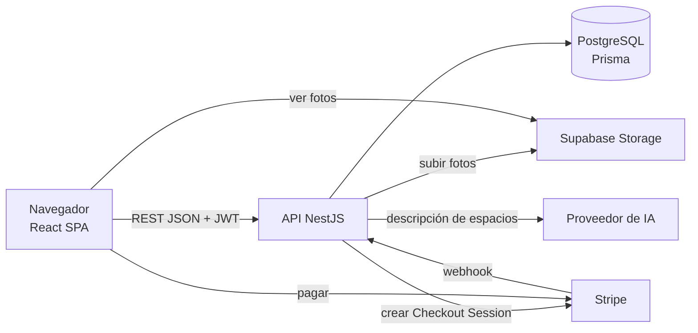
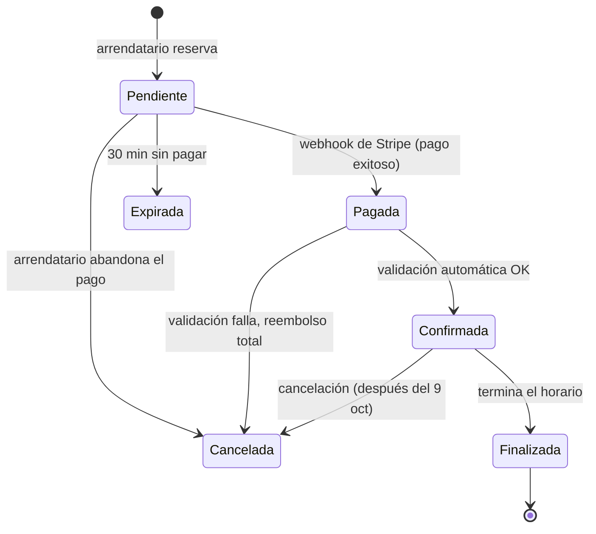
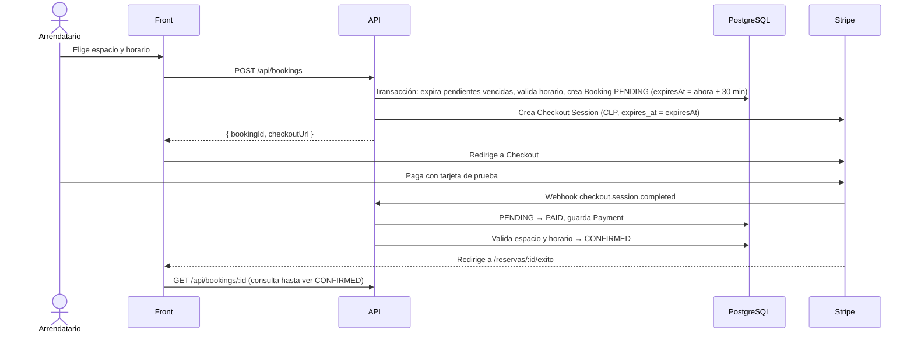

# Arquitectura

## Vista general



- **Front** (`rentsmart-front`): SPA en React 19 + Vite 8 + Tailwind 4, en TypeScript ([P-04](decisiones.md#p-04--front-en-typescript)).
- **Back** (`rentsmart-back`): API REST en NestJS 12 + TypeScript.
- **Base de datos:** PostgreSQL con Prisma ([P-03](decisiones.md#p-03--postgresql--prisma)).
- **Fotos:** Supabase Storage ([P-10](decisiones.md#p-10--fotos-en-supabase-storage)).
- **Pagos:** Stripe Checkout en modo test.
- **IA:** proveedor por definir ([P-15](https://github.com/AlejandroMG/inf331-equipo-3/issues/82)), detrás de una interfaz propia.

## Backend

Un módulo de NestJS por dominio. Cada integrante trabaja en sus módulos para evitar conflictos.

| Módulo | Responsabilidad | Dueño |
|---|---|---|
| `prisma` | `PrismaService` compartido y migraciones | A |
| `auth` | Registro, login, JWT, `JwtAuthGuard`, `RolesGuard`, `@CurrentUser()` | A |
| `users` | Perfil y modo propietario | A |
| `ai` | `AiProvider` (interfaz), implementación real y mock | A |
| `admin` | Endpoints de administración | A |
| `reviews` | Reseñas (después del 9 de octubre) | A |
| `spaces` | CRUD de espacios, reglas de publicación | B |
| `space-types` | Tipos de espacio, equipamiento, regiones y comunas | B |
| `catalog` | Listado público, filtros y búsqueda | B |
| `owner` | Panel del propietario: reservas de sus espacios y métricas | B |
| `storage` | `StorageService` sobre Supabase Storage | B |
| `availability` | Horario semanal y servicio `isAvailable()` | C |
| `bookings` | Reservas, máquina de estados, validación de conflictos | C |
| `payments` | Stripe Checkout, webhook, registro de pagos y reembolsos | C |

Estructura de cada módulo:

```
src/bookings/
├── bookings.module.ts
├── bookings.controller.ts
├── bookings.service.ts
├── bookings.service.spec.ts
└── dto/
    └── create-booking.dto.ts
```

### Convenciones de la API

- REST JSON bajo el prefijo `/api`. Swagger (`@nestjs/swagger`) en `/docs`.
- Autenticación con `Authorization: Bearer <jwt>`.
- DTOs validados con `class-validator` mediante un `ValidationPipe` global.
- Códigos de error: 400 validación, 401 sin sesión, 403 sin permiso, 404 no existe, 409 conflicto de estado o de horario.
- Fechas en ISO 8601 y UTC. Montos en CLP como enteros.
- Listados paginados con `?page=1&pageSize=20`; la respuesta trae `{ items, total, page, pageSize }`.
- La configuración común (prefijo, `ValidationPipe`, Swagger) vive en `src/app.setup.ts` y la usan `main.ts` y los tests e2e. `main.ts` crea la app con `rawBody: true` para el webhook de Stripe.

### Sesión y permisos (CU-03)

`AuthModule` es global: cualquier módulo usa los guards sin importarlo.

```ts
@ApiBearerAuth()
@UseGuards(JwtAuthGuard)                 // exige sesión: 401 sin token, con token inválido, expirado o de una cuenta suspendida
@Controller('bookings')
export class BookingsController {
  @Get()
  list(@CurrentUser() user: AuthUser) {}  // { id, role } del usuario de la sesión

  @Get('all')
  @UseGuards(RolesGuard)
  @Roles(UserRole.ADMIN)                  // 403 si el rol no está en la lista
  listAll() {}
}
```

- `JwtAuthGuard` (`src/auth/guards`) revisa el token y además al usuario en la base: una cuenta suspendida pierde el acceso de inmediato y el rol se toma de la base, no del token.
- `@CurrentUser()` y `AuthUser` están en `src/common/auth`.
- `GET /api/auth/me` devuelve el usuario de la sesión; el front lo usa para armar el menú según el rol.
- En los e2e, `bearer(app, userId)` de `test/utils/auth.ts` entrega el encabezado `Authorization` con un token válido.

### Datos de referencia (ES-01)

Listas públicas y de solo lectura que alimentan los formularios y filtros. Módulo `space-types`; devuelven `[{ id, name }]`.

| Endpoint | Devuelve |
|---|---|
| `GET /api/space-types` | Tipos de espacio, en el orden en que se cargaron |
| `GET /api/amenities` | Equipamiento, por nombre |
| `GET /api/regions` | Regiones, por nombre |
| `GET /api/regions/:id/communes` | Comunas de la región, por nombre. 404 si la región no existe, 400 si `id` no es un número |

### Catálogo público (BU-01 a BU-04)

Módulo `catalog`, sin sesión. Solo muestra espacios `ACTIVE`: borradores, inactivos y bloqueados dan lista vacía o 404.

| Endpoint | Devuelve |
|---|---|
| `GET /api/catalog?page=&pageSize=` y los filtros de abajo | `{ items, total, page, pageSize }`, los más recientes primero. `page` ≥ 1 (1 por defecto), `pageSize` de 1 a 50 (12 por defecto). Cualquier otro parámetro o valor inválido da 400 |
| `GET /api/catalog/:id` | Detalle público: datos del espacio, `regionName`, `address`, `location` (zona aproximada en el mapa), `amenities` (nombres), `photos` por posición y `schedule` semanal. 404 si no existe o no está activo |

- Cada item de la lista es `{ id, name, typeName, communeName, capacity, pricePerHour, pricePerDay, coverUrl }` (`null` donde no aplique).
- **Nunca** se devuelve `addressDetail` (P-09), `ownerId` ni `status`: el `select` de `CatalogService` es una lista blanca y hay tests e2e que lo comprueban. El detalle de la dirección se entregará con la reserva confirmada.
- **Ubicación en el mapa (ES-07, P-19):** `location` del detalle es `{ latitude, longitude, radiusMeters }`, o `null` si el propietario no marcó el punto. Las coordenadas van **redondeadas a 3 decimales** (~110 m) y `radiusMeters` es 150: el punto real queda siempre dentro del círculo, y el exacto **nunca** sale de la API pública (la lista del catálogo no trae coordenadas). El redondeo está en `src/catalog/approximate-location.ts`.
- **Filtros (BU-03)**, todos opcionales y combinables: si se dan varios deben cumplirse todos, y `total` cuenta solo los espacios que cumplen. Sin filtros se listan todos los activos.
  - `typeId` y `communeId`: enteros ≥ 1, los ids de `GET /api/space-types` y de las comunas. Un id que no existe da lista vacía, no un error.
  - `minCapacity`: de 1 a 1000; espacios para esa cantidad de personas o más.
  - `minPrice` y `maxPrice`: CLP enteros de 0 a 10.000.000, con los extremos incluidos. Un mínimo mayor que el máximo da 400.
  - `priceUnit`: `hour` (por defecto) o `day`. Es la unidad a la que se aplica el rango: el **precio por hora** o el **precio por día**. Un espacio que no se arrienda en esa unidad (su precio es `null`) no cumple un filtro de precio. Sin `minPrice` ni `maxPrice` no tiene efecto.
  - `q`: texto de hasta 100 caracteres. Se usan hasta 5 palabras y **cada una** debe aparecer en el nombre, la descripción, el tipo o la comuna, sin distinguir mayúsculas (sí distingue tildes). No busca en la dirección ni en su detalle privado (P-09), así que la búsqueda no sirve para averiguarlo. Un texto en blanco se ignora, y `%` y `_` se buscan como texto.
- **Orden (BU-04):** `sort` = `recent` (por defecto, los más recientes primero), `price_asc` (de menor a mayor) o `price_desc` (de mayor a menor). Cualquier otro valor da 400. El precio es el de `priceUnit` (por hora, salvo que se pida `day`), y los espacios que no se arriendan en esa unidad van **al final en las dos direcciones**. Siempre se desempata por fecha (más reciente primero) y por id, así la paginación es estable aunque haya precios iguales. El orden no cambia qué espacios se listan ni el `total`.
- Ordenar por calificación llegará con las reseñas (A, después del 9 de octubre): hoy no existe ese dato.

### Panel del propietario (PN-02, PN-04)

Módulo `owner`. Requieren sesión (hoy con el `DevAuthGuard` temporal) y cada propietario ve solo lo suyo. Solo **leen** la tabla `Booking`: crear una reserva y cambiarla de estado es del módulo de reservas (C).

| Endpoint | Qué hace |
|---|---|
| `GET /api/owner/bookings` | Las reservas de todos mis espacios: `{ items, total, page, pageSize }`. Filtros opcionales: `status` (un estado de la reserva), `from` y `to` (`AAAA-MM-DD`, el día de inicio de la reserva, **hora de Chile**, con el día final incluido) y `sort` (`desc` por defecto, o `asc`). `page` ≥ 1, `pageSize` de 1 a 50 (20 por defecto) |
| `GET /api/owner/metrics?month=AAAA-MM` | Ingresos y ocupación de un mes (el actual si no se da): `{ month, income, bookings, spaces: [...] }` |

- Cada reserva trae `{ id, spaceId, spaceName, renterName, startAt, endAt, unit, subtotal, status, contact }`. `subtotal` es lo que recibe el propietario (la comisión se suma al arrendatario, P-13). `contact` (`{ email, phone }` del arrendatario) solo viene en las **confirmadas** y es `null` en cualquier otro estado.
- **Métricas:** cuentan las reservas `CONFIRMED` y `FINISHED` que **empiezan** en el mes (hora de Chile). Por espacio (no borradores, por nombre): `income`, `bookings`, `bookedHours`, `availableHours` (su horario semanal por las veces que cada día de la semana cae en el mes) y `occupancy` (reservadas sobre arrendables, de 0 a 1; `null` si no tiene horario).
- **Hora de Chile:** los días y los meses se miden en `America/Santiago`, no en UTC: la reserva del 31 de octubre a las 23:00 es de octubre aunque en UTC ya sea el 1 de noviembre. El cálculo (con el cambio de horario de verano) está en `src/common/santiago-time.ts`.
- Un parámetro inválido o desconocido, una fecha que no existe (31 de febrero) o una fecha inicial posterior a la final dan 400.

### Espacios del propietario (ES-02)

Módulo `spaces`. Requieren sesión y solo el dueño accede a su espacio (403 si es de otro, 404 si no existe).

| Endpoint | Qué hace |
|---|---|
| `POST /api/spaces` | Crea un espacio en `DRAFT`. Solo el nombre es obligatorio |
| `PATCH /api/spaces/:id` | Actualización parcial: lo que no se manda no cambia y `null` borra un campo opcional. `amenityIds` reemplaza el equipamiento completo. No cambia el estado |
| `GET /api/spaces/me` | Mis espacios (PN-01): los del usuario, de cualquier estado, los modificados más recientemente primero. Cada uno trae `{ id, status, name, typeName, communeName, pricePerHour, pricePerDay, coverUrl, missing, updatedAt }`, donde `missing` es lo que le falta para publicarse o mantenerse publicado |
| `GET /api/spaces/:id` | El espacio con su estado y el detalle privado de la dirección (`addressDetail`) |

- El formulario por pasos guarda un borrador en cada paso: por eso casi todos los campos son opcionales. Las reglas para publicar (foto, precio, capacidad, descripción y horario) las valida ES-04 al publicar.
- Se comprueba que existan el tipo, la región, la comuna y el equipamiento, y que la comuna sea de la región (400). Si solo se manda la comuna, se guarda su región.
- Límites: nombre hasta 100 caracteres, capacidad de 1 a 1000, precios de 1 a 10.000.000 CLP.
- **Punto en el mapa (ES-07):** `latitude` y `longitude` son opcionales y van **juntas** (las dos o ninguna; si no, 400, y la BD también lo exige con un `CHECK`). Deben estar dentro de Chile (latitud de -56 a -17, longitud de -110 a -66, hasta 6 decimales). `null` en las dos borra el punto. El dueño recibe el punto exacto en `GET /api/spaces/:id`.

#### Publicar y activar (ES-04, ES-06)

Requieren sesión y ser el dueño (403 si es de otro, 404 si no existe).

| Endpoint | Qué hace |
|---|---|
| `POST /api/spaces/:id/publish` | Pasa un borrador a `ACTIVE` y marca la cuenta como propietaria (`isHost`, P-02). 409 si falta algo o el espacio no es un borrador |
| `PATCH /api/spaces/:id/status` | `{ status: "ACTIVE" \| "INACTIVE" }`. Desactivar saca el espacio del catálogo (las reservas confirmadas se mantienen); activar exige seguir cumpliendo lo necesario. Pedir el estado que ya tiene no hace nada |

- **Qué se exige para publicar** ([P-18](decisiones.md#p-18--tipo-y-comuna-también-son-obligatorios-para-publicar)): tipo, descripción, capacidad, comuna, precio (por hora o por día), al menos una foto y horario semanal (al menos una `AvailabilityRule`). Si falta algo, la respuesta es `409` con `{ statusCode, error, message, missing: [...] }`, donde `missing` usa los códigos `type`, `description`, `capacity`, `commune`, `price`, `photos` y `schedule`.
- **Estados:** `DRAFT` → `ACTIVE` solo por `publish`; `ACTIVE` ↔ `INACTIVE` por `status`; `BLOCKED` solo lo pone un admin y el propietario no puede cambiarlo (403). Un borrador no se activa ni desactiva por `status` (409).
- **Un espacio publicado sigue completo:** `PATCH /api/spaces/:id` y borrar su última foto responden 409 con `missing` si lo dejarían sin algo de lo necesario. Un cambio de precio, nombre o reglas vale.
- El horario semanal lo escribe la historia DI-01 del equipo de reservas; mientras no exista, un espacio nuevo no se puede publicar desde la app (los tests lo crean directo en la base).
- Los cambios de estado son condicionales (`WHERE status = <anterior>`): dos peticiones a la vez no se pisan.

#### Autenticación temporal

Hasta que A entregue el login (CU-03), los endpoints protegidos usan `DevAuthGuard` (`src/common/auth/`): toma al usuario del encabezado `x-user-id` o, sin él, del propietario del seed (`propietario@rentsmart.test`), y deja `request.user` con la forma `{ id, role }` que dejará el guard real. `@CurrentUser()` entrega ese usuario. Para pasar a JWT basta reemplazar `DevAuthGuard` por `JwtAuthGuard` en cada `@UseGuards`. **Nunca funciona con `NODE_ENV=production`.**

## Frontend

```
rentsmart-front/src/
├── components/     ← Button, Input, Card, Modal, Toast
├── features/
│   ├── auth/       ← A
│   ├── admin/      ← A
│   ├── renter/     ← A: panel del arrendatario
│   ├── spaces/     ← B: publicar y editar
│   ├── catalog/    ← B: catálogo y detalle
│   ├── owner/      ← B: panel del propietario
│   └── bookings/   ← C: horario semanal, widget de reserva, pago
├── lib/            ← cliente HTTP, manejo del token, utilidades de fecha y dinero
├── mocks/          ← handlers de MSW mientras el back no exista
└── routes.tsx
```

- Rutas con React Router (`src/routes.tsx`, un arreglo de `RouteObject`). Cada dominio agrega las suyas. Las rutas dentro de `<RequireAuth />` exigen token y, sin él, redirigen a `/login` guardando la ruta pedida en `state.from`.
- El cliente HTTP (`src/lib/http.ts`) lee la URL base desde `VITE_API_URL` (sin `/api`: el cliente lo agrega), adjunta `Authorization: Bearer <token>` y convierte las respuestas con error en `ApiError` (`status`, `message` en español, `data`). Ante un 401 borra el token. El token vive en `localStorage` (`src/lib/token.ts`).
- Tailwind 4 se carga con el plugin `@tailwindcss/vite`; no hay `tailwind.config.js`. Los colores, tipografías y radios de la marca son variables `@theme` en `src/index.css` y dan utilidades como `bg-primary`, `text-ink`, `border-line`, `font-display` y `rounded-card`.
- Componentes base en `src/components/`: `Button` y `LinkButton`, `Input`, `Card`, `Modal` (`<dialog>` nativo) y `Toast` (`ToastProvider` más el hook `useToast`).
- En desarrollo, `/dev/componentes` muestra una guía de esos componentes. No existe en producción.
- Pruebas: `npm test` ejecuta Vitest con jsdom, Testing Library y MSW. Los handlers de la API simulada están en `src/mocks/handlers.ts` y los usan tanto los tests (`src/mocks/server.ts`) como el navegador (`src/mocks/browser.ts`, con `VITE_USE_MOCKS=true`). El setup (`src/test/setup.ts`) falla cualquier petición sin handler y simula `<dialog>`, que jsdom no implementa. Los tests viven junto al código (`*.test.ts` y `*.test.tsx`).
- Catálogo y detalle (BU-01, BU-02): el contrato de `GET /api/catalog` y `GET /api/catalog/:id` está en [Catálogo público](#catálogo-público-bu-01-bu-02) (sección del back). El front usa los tipos de `src/features/catalog/types.ts` y el mismo contrato en `src/mocks/handlers.ts`. `useRequest` (`src/lib/useRequest.ts`) carga datos con cancelación, estado de carga y "Reintentar"; úsalo en las pantallas nuevas.
- Mientras A no entregue el login (CU-02), para entrar a una ruta privada en local: `localStorage.setItem('rentsmart_token', 'dev')` en la consola del navegador.

## Modelo de datos

Borrador para F-03 ([#3](https://github.com/AlejandroMG/inf331-equipo-3/issues/3)). Los nombres finales quedan en `schema.prisma`.

| Entidad | Campos clave | Dueño |
|---|---|---|
| `User` | email (único), passwordHash, name, phone, role (`USER` · `ADMIN`), isHost, status (`ACTIVE` · `SUSPENDED`) | A |
| `Region` · `Commune` | Lista cerrada cargada por el seed | B |
| `SpaceType` · `Amenity` | Catálogos administrables; `SpaceAmenity` como tabla intermedia | B |
| `Space` | ownerId, typeId, name, description, capacity, pricePerHour?, pricePerDay?, regionId, communeId, address (pública), addressDetail (privada), latitude? y longitude? (punto del mapa: exacto y solo del dueño; van juntos), rules, status (`DRAFT` · `ACTIVE` · `INACTIVE` · `BLOCKED`) | B |
| `SpacePhoto` | spaceId, storagePath, url, position | B |
| `AvailabilityRule` | spaceId, weekday (0–6), startTime, endTime (hora local, bloques de 1 h) | C |
| `Booking` | spaceId, renterId, startAt, endAt, unit (`HOUR` · `DAY`), subtotal, fee, total, status, expiresAt, stripeCheckoutSessionId | C |
| `BookingEvent` | bookingId, fromStatus, toStatus, actorId (nulo si fue el sistema), reason, createdAt | C |
| `Payment` | bookingId, stripeSessionId, stripePaymentIntentId, amount, fee, refundedAmount, status | C |
| `Review` | bookingId (único), authorId, spaceId, rating 1–5, comment (después del 9 de octubre) | A |

Estados de `Booking`: `PENDING`, `PAID`, `CONFIRMED`, `FINISHED`, `CANCELLED`, `EXPIRED`.

### Migraciones y seed

- El schema vive en `rentsmart-back/prisma/schema.prisma` y el cliente se genera en `src/generated/prisma` (no se versiona). Tras cada `git pull` con migraciones nuevas: `npx prisma migrate dev`.
- `booking_no_overlap` es una migración SQL escrita a mano (ver [Cómo se evitan reservas cruzadas](#cómo-se-evitan-reservas-cruzadas)).
- Cambios al schema: PR chico, solo del schema, avisando en el grupo; A lo revisa.
- `npm run seed` carga:

| Dato | Contenido |
|---|---|
| Usuarios | `admin@rentsmart.test` (ADMIN), `propietario@rentsmart.test` (USER, isHost), `arrendatario@rentsmart.test` (USER). Contraseña `Password123` |
| Tipos de espacio | Los 8 de P-08 |
| Ubicación | Región Metropolitana con 5 comunas |
| Equipamiento | 5 ítems básicos |
| Espacios | 10 en estado `ACTIVE`, del propietario de prueba, con horario lunes a viernes 09:00–21:00 y sin fotos |

### Fechas y dinero

- Las fechas se guardan como `timestamptz` en UTC y se muestran en `America/Santiago`.
- El horario semanal (`AvailabilityRule`) está en hora local de Santiago; el servicio de disponibilidad lo convierte a UTC para compararlo con las reservas. Hay que probar el cambio de horario de verano.
- Los montos son enteros en CLP. Stripe trata el CLP como moneda sin decimales, así que el monto se envía tal cual, sin multiplicar por 100.

## Ciclo de vida de una reserva

Decisiones [P-05](decisiones.md#p-05--reserva-inmediata) y [P-06](decisiones.md#p-06--pendiente--pagada--confirmada).



| Transición | La dispara | Historia |
|---|---|---|
| → Pendiente | Arrendatario al confirmar la reserva | RE-02 |
| Pendiente → Pagada | Webhook `checkout.session.completed` | PA-02 |
| Pendiente → Expirada | Webhook `checkout.session.expired`, o limpieza antes de crear una reserva | PA-02, RE-02 |
| Pagada → Confirmada | Validación automática: espacio activo y horario libre | RE-04 |
| Pagada → Cancelada | Validación fallida; reembolso total automático | RE-04 |
| Confirmada → Finalizada | Tarea programada al terminar el horario | RE-06 |
| Confirmada → Cancelada | Arrendatario o propietario, según política | RE-05 |

Toda transición pasa por un único método del servicio de reservas que valida el cambio (409 si no es válido) y escribe un `BookingEvent`.

### Flujo de pago



### Cómo se evitan reservas cruzadas

1. **En el servicio:** `availability.isAvailable()` revisa el horario semanal y las reservas activas antes de crear la reserva.
2. **En la base de datos:** una restricción de exclusión impide que dos reservas activas del mismo espacio se traslapen, aunque lleguen dos solicitudes al mismo tiempo. Prisma no la genera, así que va en SQL dentro de una migración:

```sql
CREATE EXTENSION IF NOT EXISTS btree_gist;

ALTER TABLE "Booking" ADD CONSTRAINT booking_no_overlap
  EXCLUDE USING gist (
    "spaceId" WITH =,
    tstzrange("startAt", "endAt", '[)') WITH &&
  ) WHERE (status IN ('PENDING', 'PAID', 'CONFIRMED'));
```

Como una `PENDING` vencida sigue contando para la restricción, antes de insertar se pasan a `EXPIRED`, en la misma transacción, las pendientes del espacio cuyo `expiresAt` ya pasó.

## Integraciones

### Stripe

- Stripe Checkout en modo test, moneda CLP. Por ahora sin Stripe Connect ([P-12](https://github.com/AlejandroMG/inf331-equipo-3/issues/79) sigue abierta).
- La Checkout Session expira a los 30 minutos, el mínimo que permite Stripe, y coincide con la retención de la reserva.
- El webhook está en `POST /api/payments/webhook`. Para verificar la firma, Nest necesita el body sin parsear: `NestFactory.create(AppModule, { rawBody: true })`.
- El webhook es idempotente: guarda el ID del evento y no procesa dos veces el mismo.
- En local se usa Stripe CLI: `stripe listen --forward-to localhost:3000/api/payments/webhook`.
- Tarjeta de prueba: `4242 4242 4242 4242`, cualquier fecha futura y cualquier CVC.

### Supabase Storage

- Bucket `space-photos` con lectura pública.
- Se sube desde el back con la service role key, que nunca llega al front.
- `StorageService` (`src/storage/`) es una clase abstracta con dos implementaciones, que se elige con `STORAGE_DRIVER`:
  - `local` (por defecto): guarda en `UPLOADS_DIR` (`./uploads`, ignorada por git) y la API la sirve en `/api/uploads/...`. Es para desarrollo y tests.
  - `supabase`: usa la API REST de Supabase Storage con `fetch` (sin dependencias); exige `SUPABASE_URL`, `SUPABASE_SERVICE_ROLE_KEY` y `SUPABASE_BUCKET` (la API no arranca si faltan). Probada solo con un `fetch` simulado; falta probarla contra un proyecto real.

#### Fotos del espacio (ES-03)

Requieren sesión y ser el dueño del espacio (403 si es de otro, 404 si no existe). La respuesta de `GET /api/spaces/:id` incluye `photos` ordenadas por posición.

| Endpoint | Qué hace |
|---|---|
| `POST /api/spaces/:id/photos` | Sube una foto (multipart, campo `file`) al final de la galería. 400 si falta o su formato no es válido, 413 si pesa más de 5 MB, 409 si ya hay 10 |
| `PATCH /api/spaces/:id/photos/order` | Ordena las fotos con `{ photoIds }`, que debe traer exactamente las fotos del espacio, sin repetir. La primera es la portada (posición 0) |
| `DELETE /api/spaces/:id/photos/:photoId` | Borra la foto y su archivo; las siguientes suben una posición. 204 |

- Se aceptan JPG, PNG y WebP, y el formato se reconoce por los primeros bytes del archivo, no por el nombre ni por el tipo que declara el navegador.
- El archivo se guarda con un nombre propio (`spaces/<espacio>/<uuid>.<ext>`); el nombre original se descarta.
- El límite de 10 y la posición se deciden bloqueando la fila del espacio (`FOR UPDATE`), así subidas simultáneas no se pasan del máximo ni repiten posición.

### IA

- Interfaz `AiProvider` con `describeSpace(fotos, datos)`. Una implementación real (proveedor según P-15) y un mock determinista para tests.
- Timeout, límite de usos por usuario y un mensaje de respaldo si el proveedor falla.
- El texto generado siempre queda editable y el propietario lo revisa antes de publicar.

## Variables de entorno

Solo `PORT`, `VITE_API_URL` y `VITE_USE_MOCKS` existen hoy. Las demás se agregan a `.env.example` en la historia que las introduce.

| Variable | App | Para qué | Historia |
|---|---|---|---|
| `PORT` | back | Puerto de la API (3000 por defecto) | — |
| `VITE_API_URL` | front | URL base de la API. En desarrollo, `http://localhost:5173` usa el proxy de Vite (sin CORS) | F-07 |
| `VITE_USE_MOCKS` | front | `true` activa MSW en el navegador para simular la API (solo desarrollo; opcional) | F-08 |
| `DATABASE_URL`, `DATABASE_TEST_URL` | back | Conexión a PostgreSQL | F-04, F-03 |
| `JWT_SECRET` | back | Firma de los tokens de sesión. Obligatoria, mínimo 32 caracteres | CU-02 |
| `JWT_EXPIRES_IN` | back | Duración del token (`1d`, `8h`…). Opcional, por defecto `1d` | CU-02 |
| `FRONTEND_URL` | back | Origen permitido por CORS (por defecto `http://localhost:5173`) y URLs de retorno de Stripe | CU-01, CU-05 |
| `STORAGE_DRIVER` | back | `local` (por defecto) o `supabase`: dónde se guardan las fotos | ES-03 |
| `UPLOADS_DIR` | back | Carpeta de las fotos con `local` (`./uploads` por defecto) | ES-03 |
| `SUPABASE_URL`, `SUPABASE_SERVICE_ROLE_KEY`, `SUPABASE_BUCKET` | back | Subida de fotos; obligatorias con `STORAGE_DRIVER=supabase` | ES-03 |
| `STRIPE_SECRET_KEY`, `STRIPE_WEBHOOK_SECRET` | back | Checkout y verificación del webhook | PA-01, PA-02 |
| `PLATFORM_FEE_PERCENT` | back | Comisión de la plataforma (depende de P-13) | RE-02 |
| `AI_API_KEY`, `AI_MODEL` | back | Proveedor de IA (depende de P-15) | IA-01 |

## Pruebas

| Nivel | Herramienta | Qué cubre |
|---|---|---|
| Unitarias back | Jest | Servicios: disponibilidad, estados de reserva, precios, reglas de publicación |
| Integración API | Jest + Supertest + BD de test (Docker) | Endpoints con base de datos real. `npm run test:e2e` usa solo `DATABASE_TEST_URL` y cada test crea y borra sus propios datos; antes, `DATABASE_URL=<la de test> npx prisma migrate deploy` |
| Componentes front | Vitest + Testing Library + MSW | Formularios y componentes con lógica |
| E2E | Playwright | Flujo completo (después del 9 de octubre, QA-01) |

La meta de cobertura espera la respuesta del profesor ([P-11](https://github.com/AlejandroMG/inf331-equipo-3/issues/78)). Mientras tanto se aplica la [definición de terminado](flujo-de-trabajo.md#definición-de-terminado).
