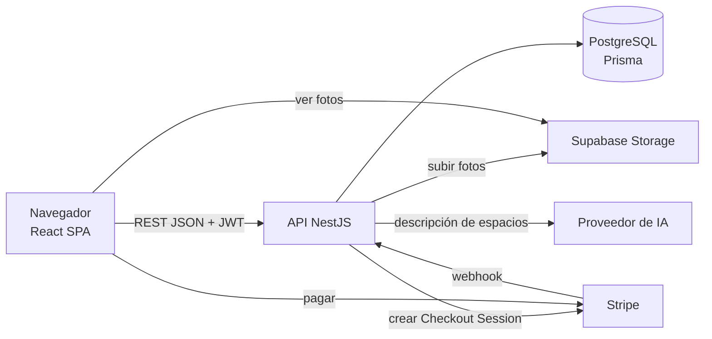
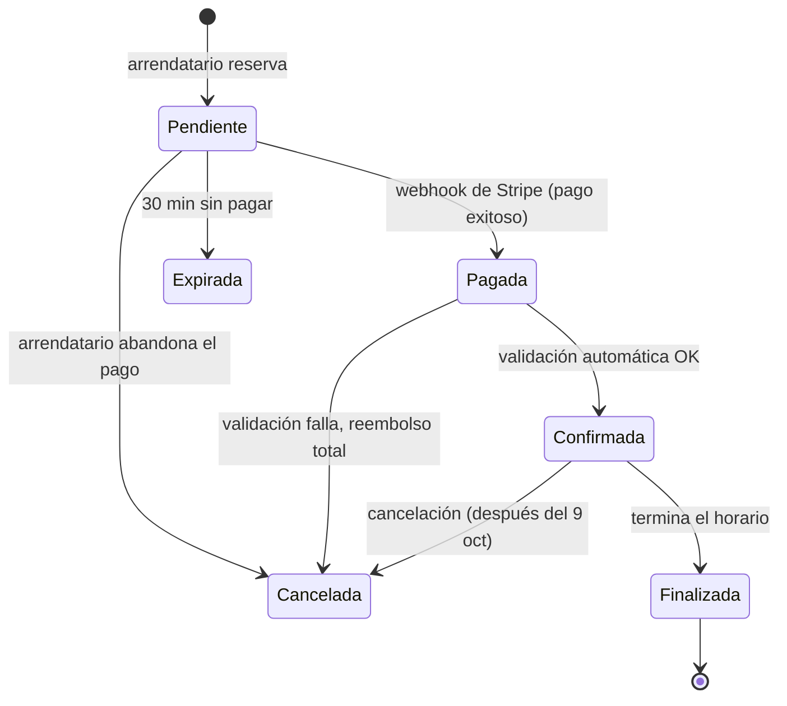
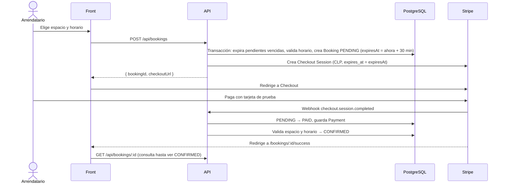

# Arquitectura

## Vista general



- **Front** (`rentsmart-front`): SPA en React 19 + Vite 8 + Tailwind 4, en TypeScript ([P-04](decisiones.md#p-04--front-en-typescript)).
- **Back** (`rentsmart-back`): API REST en NestJS 12 + TypeScript.
- **Base de datos:** PostgreSQL con Prisma ([P-03](decisiones.md#p-03--postgresql--prisma)).
- **Fotos:** Supabase Storage ([P-10](decisiones.md#p-10--fotos-en-supabase-storage)).
- **Pagos:** Stripe Checkout en modo test.
- **IA:** proveedor por definir ([P-15](https://github.com/AlejandroMG/inf331-equipo-3/issues/82)), detrás de una interfaz propia.

## Backend

Un módulo de NestJS por dominio. Cada integrante trabaja en sus módulos para evitar conflictos.

| Módulo | Responsabilidad | Dueño |
|---|---|---|
| `prisma` | `PrismaService` compartido y migraciones | A |
| `auth` | Registro, login, JWT, `JwtAuthGuard`, `RolesGuard`, `@CurrentUser()` | A |
| `users` | Perfil y modo propietario | A |
| `ai` | `AiProvider` (interfaz), implementación real y mock | A |
| `admin` | Endpoints de administración | A |
| `reviews` | Reseñas (después del 9 de octubre) | A |
| `spaces` | CRUD de espacios, reglas de publicación | B |
| `space-types` | Tipos de espacio, equipamiento, regiones y comunas | B |
| `catalog` | Listado público, filtros y búsqueda | B |
| `owner` | Panel del propietario: reservas de sus espacios y métricas | B |
| `storage` | `StorageService` sobre Supabase Storage | B |
| `availability` | Horario semanal y servicio `isAvailable()` | C |
| `bookings` | Reservas, máquina de estados, validación de conflictos | C |
| `payments` | Stripe Checkout, webhook, registro de pagos y reembolsos | C |

Estructura de cada módulo:

```
src/bookings/
├── bookings.module.ts
├── bookings.controller.ts
├── bookings.service.ts
├── bookings.service.spec.ts
└── dto/
    └── create-booking.dto.ts
```

### Convenciones de la API

- REST JSON bajo el prefijo `/api`. Swagger (`@nestjs/swagger`) en `/docs`.
- Autenticación con `Authorization: Bearer <jwt>`.
- DTOs validados con `class-validator` mediante un `ValidationPipe` global.
- Códigos de error: 400 validación, 401 sin sesión, 403 sin permiso, 404 no existe, 409 conflicto de estado o de horario.
- Fechas en ISO 8601 y UTC. Montos en CLP como enteros.
- Listados paginados con `?page=1&pageSize=20`; la respuesta trae `{ items, total, page, pageSize }`.
- La configuración común (prefijo, `ValidationPipe`, Swagger) vive en `src/app.setup.ts` y la usan `main.ts` y los tests e2e. `main.ts` crea la app con `rawBody: true` para el webhook de Stripe.

### Sesión y permisos (CU-03)

`AuthModule` es global: cualquier módulo usa los guards sin importarlo.

```ts
@ApiBearerAuth()
@UseGuards(JwtAuthGuard)                 // exige sesión: 401 sin token, con token inválido, expirado o de una cuenta suspendida
@Controller('bookings')
export class BookingsController {
  @Get()
  list(@CurrentUser() user: AuthUser) {}  // { id, role } del usuario de la sesión

  @Get('all')
  @UseGuards(RolesGuard)
  @Roles(UserRole.ADMIN)                  // 403 si el rol no está en la lista
  listAll() {}
}
```

- `JwtAuthGuard` (`src/auth/guards`) revisa el token y además al usuario en la base: una cuenta suspendida pierde el acceso de inmediato y el rol se toma de la base, no del token.
- `@CurrentUser()` y `AuthUser` están en `src/common/auth`.
- `GET /api/auth/me` devuelve el usuario de la sesión; el front lo usa para armar el menú según el rol.
- En los e2e, `bearer(app, userId)` de `test/utils/auth.ts` entrega el encabezado `Authorization` con un token válido.

### Datos de referencia (ES-01)

Listas públicas y de solo lectura que alimentan los formularios y filtros. Módulo `space-types`; devuelven `[{ id, name }]`.

| Endpoint | Devuelve |
|---|---|
| `GET /api/space-types` | Tipos de espacio, en el orden en que se cargaron |
| `GET /api/amenities` | Equipamiento, por nombre |
| `GET /api/regions` | Regiones, por nombre |
| `GET /api/regions/:id/communes` | Comunas de la región, por nombre. 404 si la región no existe, 400 si `id` no es un número |

### Catálogo público (BU-01 a BU-04)

Módulo `catalog`, sin sesión. Solo muestra espacios `ACTIVE`: borradores, inactivos y bloqueados dan lista vacía o 404.

| Endpoint | Devuelve |
|---|---|
| `GET /api/catalog?page=&pageSize=` y los filtros de abajo | `{ items, total, page, pageSize }`, los más recientes primero. `page` ≥ 1 (1 por defecto), `pageSize` de 1 a 50 (12 por defecto). Cualquier otro parámetro o valor inválido da 400 |
| `GET /api/catalog/:id` | Detalle público: datos del espacio, `regionName`, `address`, `location` (zona aproximada en el mapa), `amenities` (nombres), `photos` por posición y `schedule` semanal. 404 si no existe o no está activo |

- Cada item de la lista es `{ id, name, typeName, communeName, capacity, pricePerHour, pricePerDay, coverUrl }` (`null` donde no aplique).
- **Nunca** se devuelve `addressDetail` (P-09), `ownerId` ni `status`: el `select` de `CatalogService` es una lista blanca y hay tests e2e que lo comprueban. El detalle de la dirección se entregará con la reserva confirmada.
- **Ubicación en el mapa (ES-07, P-19):** `location` del detalle es `{ latitude, longitude, radiusMeters }`, o `null` si el propietario no marcó el punto. Las coordenadas van **redondeadas a 3 decimales** (~110 m) y `radiusMeters` es 150: el punto real queda siempre dentro del círculo, y el exacto **nunca** sale de la API pública (la lista del catálogo no trae coordenadas). El redondeo está en `src/catalog/approximate-location.ts`.
- **Filtros (BU-03)**, todos opcionales y combinables: si se dan varios deben cumplirse todos, y `total` cuenta solo los espacios que cumplen. Sin filtros se listan todos los activos.
  - `typeId` y `communeId`: enteros ≥ 1, los ids de `GET /api/space-types` y de las comunas. Un id que no existe da lista vacía, no un error.
  - `minCapacity`: de 1 a 1000; espacios para esa cantidad de personas o más.
  - `minPrice` y `maxPrice`: CLP enteros de 0 a 10.000.000, con los extremos incluidos. Un mínimo mayor que el máximo da 400.
  - `priceUnit`: `hour` (por defecto) o `day`. Es la unidad a la que se aplica el rango: el **precio por hora** o el **precio por día**. Un espacio que no se arrienda en esa unidad (su precio es `null`) no cumple un filtro de precio. Sin `minPrice` ni `maxPrice` no tiene efecto.
  - `q`: texto de hasta 100 caracteres. Se usan hasta 5 palabras y **cada una** debe aparecer en el nombre, la descripción, el tipo o la comuna, sin distinguir mayúsculas (sí distingue tildes). No busca en la dirección ni en su detalle privado (P-09), así que la búsqueda no sirve para averiguarlo. Un texto en blanco se ignora, y `%` y `_` se buscan como texto.
- **Orden (BU-04):** `sort` = `recent` (por defecto, los más recientes primero), `price_asc` (de menor a mayor) o `price_desc` (de mayor a menor). Cualquier otro valor da 400. El precio es el de `priceUnit` (por hora, salvo que se pida `day`), y los espacios que no se arriendan en esa unidad van **al final en las dos direcciones**. Siempre se desempata por fecha (más reciente primero) y por id, así la paginación es estable aunque haya precios iguales. El orden no cambia qué espacios se listan ni el `total`.
- Ordenar por calificación llegará con las reseñas (A, después del 9 de octubre): hoy no existe ese dato.

### Administración de espacios y tipos (AD-02)

Dentro de los módulos `spaces` y `space-types`, bajo `/api/admin`. Requieren sesión **y rol `ADMIN`** (403 a cualquier otro usuario): se usa `@UseGuards(JwtAuthGuard, RolesGuard)` con `@Roles('ADMIN')` (CU-03).

| Endpoint | Qué hace |
|---|---|
| `GET /api/admin/spaces?status=&q=&page=&pageSize=` | Todos los espacios, de cualquier propietario y estado, los modificados más recientemente primero, con el nombre y el email del propietario y el motivo del bloqueo. `q` busca en el nombre del espacio y en el nombre o el email del propietario |
| `POST /api/admin/spaces/:id/block` | Despublica (bloquea) un espacio con un `reason` de 5 a 500 caracteres. 409 si es un borrador o ya está bloqueado |
| `POST /api/admin/spaces/:id/unblock` | Lo desbloquea: queda `INACTIVE` y el propietario decide cuándo activarlo. 409 si no está bloqueado |
| `GET /api/admin/space-types` | Los tipos de espacio con cuántos espacios usa cada uno |
| `POST /api/admin/space-types` | Crea un tipo (`name`, de 2 a 60 caracteres, sin espacios de más). 409 si ya existe (sin distinguir mayúsculas ni tildes) y 400 si es un alojamiento (P-08) |
| `PATCH /api/admin/space-types/:id` | Renombra un tipo, con las mismas reglas. No se borran: hay espacios que los usan |

- Un espacio **bloqueado** sale del catálogo, su propietario no puede activarlo (403) y ve el motivo en `blockedReason` (en `GET /api/spaces/me` y en `GET /api/spaces/:id`). Las reservas confirmadas se mantienen. Se guardan `blockedReason` y `blockedAt` en `Space`, y se borran al desbloquear.
- Los tipos nuevos aparecen enseguida en `GET /api/space-types` (el público), y por tanto en el formulario de publicar y en los filtros del catálogo.
### Panel del propietario (PN-02, PN-04)

Módulo `owner`. Requieren sesión (`JwtAuthGuard`, CU-03) y cada propietario ve solo lo suyo. Solo **leen** la tabla `Booking`: crear una reserva y cambiarla de estado es del módulo de reservas (C).

| Endpoint | Qué hace |
|---|---|
| `GET /api/owner/bookings` | Las reservas de todos mis espacios: `{ items, total, page, pageSize }`. Filtros opcionales: `status` (un estado de la reserva), `from` y `to` (`AAAA-MM-DD`, el día de inicio de la reserva, **hora de Chile**, con el día final incluido) y `sort` (`desc` por defecto, o `asc`). `page` ≥ 1, `pageSize` de 1 a 50 (20 por defecto) |
| `GET /api/owner/metrics?month=AAAA-MM` | Ingresos y ocupación de un mes (el actual si no se da): `{ month, income, bookings, spaces: [...] }` |

- Cada reserva trae `{ id, spaceId, spaceName, renterName, startAt, endAt, unit, subtotal, status, contact }`. `subtotal` es lo que recibe el propietario (la comisión se suma al arrendatario, P-13). `contact` (`{ email, phone }` del arrendatario) solo viene en las **confirmadas** y es `null` en cualquier otro estado.
- **Métricas:** cuentan las reservas `CONFIRMED` y `FINISHED` que **empiezan** en el mes (hora de Chile). Por espacio (no borradores, por nombre): `income`, `bookings`, `bookedHours`, `availableHours` (su horario semanal por las veces que cada día de la semana cae en el mes) y `occupancy` (reservadas sobre arrendables, de 0 a 1; `null` si no tiene horario).
- **Hora de Chile:** los días y los meses se miden en `America/Santiago`, no en UTC: la reserva del 31 de octubre a las 23:00 es de octubre aunque en UTC ya sea el 1 de noviembre. El cálculo (con el cambio de horario de verano) está en `src/common/santiago-time.ts`.
- Un parámetro inválido o desconocido, una fecha que no existe (31 de febrero) o una fecha inicial posterior a la final dan 400.
### Favoritos (BU-08)

Dentro del módulo `catalog`. Requieren sesión (`JwtAuthGuard`, CU-03) y cada usuario ve solo los suyos.

| Endpoint | Qué hace |
|---|---|
| `GET /api/favorites?page=&pageSize=` | Mis favoritos como tarjetas del catálogo (`{ items, total, page, pageSize }`), el último guardado primero. Solo los que siguen activos. Mismos topes de `page` y `pageSize` que el catálogo; cualquier otro parámetro da 400 |
| `GET /api/favorites/ids` | Solo los ids de mis favoritos activos, para marcar el corazón en el catálogo sin pedir cada espacio |
| `PUT /api/favorites/:spaceId` | Guarda un espacio. 204, e idempotente (guardar uno que ya es favorito no cambia nada). 404 si no existe o no está activo; 409 al llegar a 200 favoritos |
| `DELETE /api/favorites/:spaceId` | Lo quita. 204, e idempotente |

- Un espacio que se desactiva deja de verse en los favoritos pero no se pierde: reaparece si se vuelve a activar. Borrar el espacio o el usuario borra sus favoritos (`ON DELETE CASCADE`).
- Las tarjetas salen del mismo `select` y de la misma función que el catálogo (`CATALOG_ITEM_SELECT` y `toCatalogItem`, en `catalog.service.ts`): lo que no sale del catálogo público (`addressDetail`, coordenadas, `ownerId`) tampoco sale de aquí.

### Espacios del propietario (ES-02)

Módulo `spaces`. Requieren sesión y solo el dueño accede a su espacio (403 si es de otro, 404 si no existe).

| Endpoint | Qué hace |
|---|---|
| `POST /api/spaces` | Crea un espacio en `DRAFT`. Solo el nombre es obligatorio |
| `PATCH /api/spaces/:id` | Actualización parcial: lo que no se manda no cambia y `null` borra un campo opcional. `amenityIds` reemplaza el equipamiento completo. No cambia el estado |
| `GET /api/spaces/me` | Mis espacios (PN-01): los del usuario, de cualquier estado, los modificados más recientemente primero. Cada uno trae `{ id, status, name, typeName, communeName, pricePerHour, pricePerDay, coverUrl, missing, updatedAt }`, donde `missing` es lo que le falta para publicarse o mantenerse publicado |
| `GET /api/spaces/:id` | El espacio con su estado y el detalle privado de la dirección (`addressDetail`) |

- El formulario por pasos guarda un borrador en cada paso: por eso casi todos los campos son opcionales. Las reglas para publicar (foto, precio, capacidad, descripción y horario) las valida ES-04 al publicar.
- Se comprueba que existan el tipo, la región, la comuna y el equipamiento, y que la comuna sea de la región (400). Si solo se manda la comuna, se guarda su región.
- Límites: nombre hasta 100 caracteres, capacidad de 1 a 1000, precios de 1 a 10.000.000 CLP.
- **Punto en el mapa (ES-07):** `latitude` y `longitude` son opcionales y van **juntas** (las dos o ninguna; si no, 400, y la BD también lo exige con un `CHECK`). Deben estar dentro de Chile (latitud de -56 a -17, longitud de -110 a -66, hasta 6 decimales). `null` en las dos borra el punto. El dueño recibe el punto exacto en `GET /api/spaces/:id`.

#### Publicar y activar (ES-04, ES-06)

Requieren sesión y ser el dueño (403 si es de otro, 404 si no existe).

| Endpoint | Qué hace |
|---|---|
| `POST /api/spaces/:id/publish` | Pasa un borrador a `ACTIVE` y marca la cuenta como propietaria (`isHost`, P-02). 409 si falta algo o el espacio no es un borrador |
| `PATCH /api/spaces/:id/status` | `{ status: "ACTIVE" \| "INACTIVE" }`. Desactivar saca el espacio del catálogo (las reservas confirmadas se mantienen); activar exige seguir cumpliendo lo necesario. Pedir el estado que ya tiene no hace nada |
| `DELETE /api/spaces/:id` | Elimina el espacio con sus fotos (también del almacenamiento), equipamiento, horario y favoritos (ES-08). 204 si se borró; 409 si tiene reservas de cualquier estado (hay que desactivarlo, [P-20](decisiones.md#p-20--un-espacio-con-reservas-no-se-elimina-se-desactiva)); 403 si es de otro o está bloqueado; 404 si no existe |

- **Qué se exige para publicar** ([P-18](decisiones.md#p-18--tipo-y-comuna-también-son-obligatorios-para-publicar)): tipo, descripción, capacidad, comuna, precio (por hora o por día), al menos una foto y horario semanal (al menos una `AvailabilityRule`). Si falta algo, la respuesta es `409` con `{ statusCode, error, message, missing: [...] }`, donde `missing` usa los códigos `type`, `description`, `capacity`, `commune`, `price`, `photos` y `schedule`.
- **Estados:** `DRAFT` → `ACTIVE` solo por `publish`; `ACTIVE` ↔ `INACTIVE` por `status`; `BLOCKED` solo lo pone un admin y el propietario no puede cambiarlo (403). Un borrador no se activa ni desactiva por `status` (409).
- **Un espacio publicado sigue completo:** `PATCH /api/spaces/:id` y borrar su última foto responden 409 con `missing` si lo dejarían sin algo de lo necesario. Un cambio de precio, nombre o reglas vale.
- El horario semanal es del equipo de reservas (DI-01): se carga en el paso 3 del formulario con `<WeeklySchedule>` y se guarda con `PUT /api/spaces/:id/schedule` (ver [Disponibilidad, reservas y pagos](#disponibilidad-reservas-y-pagos-f-05)).
- Los cambios de estado son condicionales (`WHERE status = <anterior>`): dos peticiones a la vez no se pisan.

#### Autenticación temporal

Hasta que A entregue el login (CU-03), los endpoints protegidos usan `DevAuthGuard` (`src/common/auth/`): toma al usuario del encabezado `x-user-id` o, sin él, del propietario del seed (`propietario@rentsmart.test`), y deja `request.user` con la forma `{ id, role }` que dejará el guard real. `@CurrentUser()` entrega ese usuario. Para pasar a JWT basta reemplazar `DevAuthGuard` por `JwtAuthGuard` en cada `@UseGuards`. **Nunca funciona con `NODE_ENV=production`.**

### Disponibilidad, reservas y pagos (F-05)

Módulos `availability`, `bookings` y `payments` (C). Las rutas, los DTOs y la validación de entrada de todos existen y están en Swagger. **Ya está implementado el horario semanal (DI-01);** el resto es todavía solo el contrato y sus servicios responden `501` hasta que entre la historia de cada uno. El front trabaja mientras tanto contra los mocks de MSW (`src/mocks/bookings-handlers.ts`), que tienen las mismas formas y códigos. Los campos de cada DTO están en `/docs`; aquí va lo que Swagger no cuenta.

| Endpoint | Sesión | Qué hace | Historia |
|---|---|---|---|
| `GET /api/spaces/:id/availability?from=&to=` | No | Bloques libres de una hora por cada día pedido: `{ spaceId, timeZone, days: [{ date, slots: [{ startAt, endAt }], fullDay }] }`. 400 si falta una fecha, no es `AAAA-MM-DD`, `from` es posterior a `to` o se piden más de 31 días; 404 si el espacio no existe o no está activo | DI-02 |
| `GET /api/spaces/:id/schedule` | Sí, el dueño | El horario semanal de un espacio propio, también de un borrador: `{ rules: [{ weekday, startTime, endTime }] }` | DI-01 |
| `PUT /api/spaces/:id/schedule` | Sí, el dueño | Reemplaza el horario completo con `{ rules }` y lo devuelve ordenado. 400 si un día u hora no vale, el fin no es posterior al inicio o dos rangos del mismo día se traslapan; 409 con `missing: ["schedule"]` si dejaría sin horario a un espacio publicado | DI-01 |
| `POST /api/bookings` | Sí | `{ spaceId, startAt, endAt, unit }` → `201 { bookingId, checkoutUrl }`. Crea la reserva `PENDING` (retiene el horario 30 min) y la sesión de Stripe Checkout. 400 si las fechas no valen o el espacio no se arrienda en esa unidad; 404 si el espacio no existe o no está activo; 409 si el horario está fuera del horario semanal o ya está ocupado | RE-02, PA-01 |
| `GET /api/bookings/me?page=&pageSize=` | Sí | Mis reservas como arrendatario, de cualquier estado, las más recientes primero: `{ items, total, page, pageSize }`. `page` ≥ 1, `pageSize` de 1 a 50 (20 por defecto) | RE-02 |
| `GET /api/bookings/:id` | Sí, el arrendatario | Una reserva: `{ id, status, unit, startAt, endAt, subtotal, fee, total, expiresAt, createdAt, space }`. 403 si es de otro usuario | RE-02 |
| `POST /api/bookings/:id/cancel` | Sí, el arrendatario | Cancela y devuelve la reserva. 409 si ya no se puede cancelar. **Fuera del MVP**: depende de [P-14](https://github.com/AlejandroMG/inf331-equipo-3/issues/81) | RE-05 |
| `POST /api/payments/webhook` | No (firma de Stripe) | Recibe los eventos de Stripe y responde `200 { received: true }`. 400 si falta el encabezado `stripe-signature` o la firma no corresponde al cuerpo | PA-02 |
| `GET /api/payments/me?page=&pageSize=` | Sí | Mis pagos como arrendatario: `{ items: [{ id, bookingId, spaceName, amount, fee, refundedAmount, status, createdAt }], total, page, pageSize }` | PA-01 |

- **Días en Chile, instantes en UTC.** `from`, `to` y `date` son días del calendario en `America/Santiago` (`AAAA-MM-DD`); `startAt` y `endAt` son instantes UTC. El front no convierte zonas para reservar: manda de vuelta el `startAt` y el `endAt` que recibió en la disponibilidad.
- **Horas cerradas (P-07).** `startAt` y `endAt` de una reserva deben ser horas cerradas en UTC (`2026-10-12T12:00:00.000Z`; otro desfase o minutos dan 400). Chile siempre va a horas enteras de UTC, así que una hora cerrada allá también lo es acá.
- **Reservar por día.** `fullDay` es `{ startAt, endAt, available }`: va del primer inicio al último fin del horario de ese día (aunque tenga una pausa al medio) y es `null` si ese día no se arrienda. Para reservar el día se manda `unit: "DAY"` con exactamente ese `startAt` y ese `endAt`; se cobra el precio por día. Con `unit: "HOUR"` se cobra el precio por hora por cada bloque.
- **Un bloque está libre** si está dentro del horario semanal, no ha pasado y no lo cubre una reserva `PENDING` no vencida, `PAID` o `CONFIRMED` (P-06).
- **Horario semanal:** `weekday` de 0 (domingo) a 6, y horas cerradas en hora de Chile: `startTime` de `00:00` a `23:00` y `endTime` de `01:00` a `24:00`. Un día puede tener varios rangos y los días que no aparecen no se arriendan. Es el mismo `schedule` que muestra `GET /api/catalog/:id`. Cambiarlo no toca las reservas que ya existen.
- **Horario semanal, implementado (DI-01):** `AvailabilityService` guarda una fila de `AvailabilityRule` por rango, con las horas como texto `HH:mm` en hora de Chile (el fin puede ser `24:00`). `PUT` borra y vuelve a crear todas las reglas del espacio en una transacción, y responde las reglas ordenadas por día y hora de inicio. Dos rangos contiguos del mismo día (09:00 a 13:00 y 13:00 a 18:00) valen y se guardan tal como llegan, sin unirse. Un horario vacío vale en un borrador, en un espacio desactivado y en uno bloqueado; en uno `ACTIVE` responde el 409 de `IncompleteSpaceException` (la misma de publicar, de `src/spaces`). Las reglas de validación están en `src/availability/schedule-rules.ts`. Para leer el horario desde otro servicio (DI-02): `prisma.availabilityRule.findMany({ where: { spaceId } })`; como las horas son `HH:00` con dos dígitos, comparar el texto es comparar las horas.
- **Desglose:** `subtotal` es el precio del espacio, `fee` la comisión y `total = subtotal + fee` lo que paga el arrendatario. Todo en CLP enteros, calculado en el servidor: el cliente nunca manda montos (un campo de más da 400).
- **Detalle de la dirección (P-09):** `space` es `{ id, name, communeName, address, addressDetail, coverUrl }` y `addressDetail` solo viene en una reserva `CONFIRMED`; en cualquier otro estado es `null`.
- **Después de pagar**, Stripe devuelve al arrendatario al front, que consulta `GET /api/bookings/:id` hasta verla `CONFIRMED` (pasa por `PAID`; ver [Flujo de pago](#flujo-de-pago)).
- **Webhook:** no usa sesión; lo que lo autentica es la firma. Es idempotente: un evento repetido, o de un tipo que no interesa, responde 200 sin hacer nada. Necesita el cuerpo sin interpretar (`rawBody: true`, también en la app de los e2e: `test/utils/create-test-app.ts`).
- **Quién ve qué:** estos endpoints son la vista del arrendatario. El propietario ve las reservas de sus espacios en `GET /api/owner/bookings` ([Panel del propietario](#panel-del-propietario-pn-02-pn-04), de B).

**Supuestos mientras las decisiones sigan abiertas** (si el equipo las cierra distinto, se registra en `decisiones.md` y se ajusta el contrato):

- [P-13](https://github.com/AlejandroMG/inf331-equipo-3/issues/80), comisión: se asume la recomendación, **10 % sumado al arrendatario** y visible en el desglose. El contrato no fija el porcentaje, solo que `fee` existe y que `total = subtotal + fee`; el mock usa 10 %.
- [P-12](https://github.com/AlejandroMG/inf331-equipo-3/issues/79), Stripe: se asume **Checkout en modo test, sin Connect**. La plataforma cobra el total y registra la comisión en `Payment.fee`; no hay traspaso al propietario. Por eso el contrato no tiene nada de cuentas conectadas.
- [P-14](https://github.com/AlejandroMG/inf331-equipo-3/issues/81), cancelación: `POST /api/bookings/:id/cancel` no define plazos ni montos de reembolso.

## Frontend

```
rentsmart-front/src/
├── components/     ← Button, Input, Card, Modal, Toast
├── features/
│   ├── auth/       ← A
│   ├── admin/      ← A
│   ├── renter/     ← A: panel del arrendatario
│   ├── spaces/     ← B: publicar y editar
│   ├── catalog/    ← B: catálogo y detalle
│   ├── map/        ← B: mapas con Leaflet (detalle y formulario de publicar)
│   ├── owner/      ← B: panel del propietario
│   └── bookings/   ← C: horario semanal, widget de reserva, pago
├── lib/            ← cliente HTTP, manejo del token, utilidades de fecha y dinero
├── mocks/          ← handlers de MSW mientras el back no exista
└── routes.tsx
```

- Rutas con React Router (`src/routes.tsx`, un arreglo de `RouteObject`). Cada dominio agrega las suyas. Las rutas dentro de `<RequireAuth />` exigen token y, sin él, redirigen a `/login` guardando la ruta pedida en `state.from`.
- El cliente HTTP (`src/lib/http.ts`) lee la URL base desde `VITE_API_URL` (sin `/api`: el cliente lo agrega), adjunta `Authorization: Bearer <token>` y convierte las respuestas con error en `ApiError` (`status`, `message` en español, `data`). Ante un 401 borra el token. El token vive en `localStorage` (`src/lib/token.ts`).
- Tailwind 4 se carga con el plugin `@tailwindcss/vite`; no hay `tailwind.config.js`. Los colores, tipografías y radios de la marca son variables `@theme` en `src/index.css` y dan utilidades como `bg-primary`, `text-ink`, `border-line`, `font-display` y `rounded-card`.
- Componentes base en `src/components/`: `Button` y `LinkButton`, `Input`, `Card`, `Modal` (`<dialog>` nativo) y `Toast` (`ToastProvider` más el hook `useToast`).
- En desarrollo, `/dev/componentes` muestra una guía de esos componentes. No existe en producción.
- Pruebas: `npm test` ejecuta Vitest con jsdom, Testing Library y MSW. Los handlers de la API simulada están en `src/mocks/handlers.ts` y los usan tanto los tests (`src/mocks/server.ts`) como el navegador (`src/mocks/browser.ts`, con `VITE_USE_MOCKS=true`). El setup (`src/test/setup.ts`) falla cualquier petición sin handler y simula `<dialog>`, que jsdom no implementa. Los tests viven junto al código (`*.test.ts` y `*.test.tsx`).
- Catálogo y detalle (BU-01, BU-02): el contrato de `GET /api/catalog` y `GET /api/catalog/:id` está en [Catálogo público](#catálogo-público-bu-01-bu-02) (sección del back). El front usa los tipos de `src/features/catalog/types.ts` y el mismo contrato en `src/mocks/handlers.ts`. `useRequest` (`src/lib/useRequest.ts`) carga datos con cancelación, estado de carga y "Reintentar"; úsalo en las pantallas nuevas.
- Moderación (AD-02): `/admin/spaces` (todos los espacios, con su propietario; bloquear con un motivo y desbloquear) y `/admin/space-types` (ver, crear y renombrar tipos), en `src/features/moderation/`, con una navegación común (`AdminNav`). Son rutas privadas dentro de `<RequireAdmin />` (`src/components/RequireAdmin.tsx`), que deja pasar solo si el **rol del token** es `ADMIN` y, si no, avisa que no hay permiso. El rol se lee del contenido del JWT (`useRole()` en `src/lib/role.ts`) solo para mostrar u ocultar enlaces y pantallas (la barra muestra "Administración" solo a los administradores): quien decide qué se puede hacer es la API, que responde 403. En desarrollo con un token falso (`'dev'`) no hay rol; para ver estas pantallas hace falta iniciar sesión con un administrador o usar un token con la forma de un JWT.
- Panel del propietario (PN-01, PN-02, PN-04): tres pantallas privadas con una navegación común (`OwnerNav`): "Mis espacios" (`/owner/spaces`, con las 3 próximas reservas confirmadas), "Reservas" (`/owner/bookings`) y "Métricas" (`/owner/metrics`). Los filtros de las reservas (estado, desde, hasta, orden y página) y el mes de las métricas viven en la URL. Las fechas de la API llegan en UTC y se muestran siempre en la hora de Chile (`booking-format.ts`, con `America/Santiago`); "hoy" y "el mes actual" también se miden en Chile. El contacto del arrendatario solo existe en las reservas confirmadas.
- Favoritos (BU-08): `FavoritesProvider` (en `App.tsx`) guarda en un contexto los ids de los favoritos de la sesión (`GET /api/favorites/ids`, solo con sesión) y se olvida de ellos al cerrarla; `FavoriteButton` es el corazón de las tarjetas y el botón "Guardar en favoritos" del detalle. Marcar o desmarcar se ve al instante y se deshace, con un aviso, si el servidor lo rechaza. Sin sesión, el corazón lleva a iniciarla y regresa a la pantalla. "Mis favoritos" (`/favorites`, privada) lista las tarjetas con `GET /api/favorites`. El corazón no puede ir dentro del enlace de la tarjeta (un botón dentro de un enlace no es HTML válido): es su hermano, encima de la foto. Sin `FavoritesProvider` (por ejemplo, en la prueba de una tarjeta suelta) nada aparece guardado.
- Búsquedas recientes (BU-07): el catálogo guarda en este navegador (`localStorage`, clave `rentsmart_recent_searches`) las últimas 6 búsquedas con filtros que dieron resultados y se quedaron 3 segundos en pantalla, para repetirlas desde "Búsquedas recientes" bajo el buscador. Cada una es la URL de sus filtros, sin el orden ni la página, y no se repite. No viaja al servidor ni cruza dispositivos, y se lee validada: lo que no se entiende se descarta. La lógica está en `src/features/catalog/search-history.ts`.
- Mapas (ES-07): Leaflet con react-leaflet y las teselas de OpenStreetMap (`src/features/map/`). `LazyMaps.tsx` los carga bajo demanda (Leaflet pesa ~45 kB comprimido y queda fuera del resto de la aplicación) y los envuelve en un `ErrorBoundary`: si no cargan, el resto de la pantalla sigue. `LocationMap` dibuja el círculo del detalle público y `LocationPicker`, el mapa donde el propietario marca el punto; este último es solo una ayuda, porque las mismas coordenadas se escriben en los campos de latitud y longitud (la forma de hacerlo con teclado). Las teselas públicas de OSM tienen una [política de uso razonable](https://operations.osmfoundation.org/policies/tiles/): sirven para el MVP, y con tráfico real hay que cambiar `TILE_URL` (`map-config.ts`) por un proveedor propio. El contrato de `location` y de `latitude` y `longitude` está en [Catálogo público](#catálogo-público-bu-01-bu-02-bu-03) y [Espacios del propietario](#espacios-del-propietario-es-02).
- Horario semanal (DI-01): `<WeeklySchedule spaceId onSaved? />` (`src/features/bookings/`) carga el horario de un espacio propio y lo guarda completo con su botón "Guardar horario"; no depende del guardado del borrador. Cada día tiene una casilla y uno o más rangos "Desde" y "Hasta" en horas cerradas; los errores (fin que no es posterior al inicio, rangos traslapados) se ven bajo el día y, al intentar guardar, el foco va al primer campo inválido. `onSaved` recibe el horario guardado. Está puesto en el paso 3 de `SpaceWizard`. La lógica sin interfaz está en `schedule-form.ts` y las llamadas en `schedule-api.ts`.
- Reservas y pagos (F-05): los tipos del contrato están en `src/features/bookings/types.ts` y sus mocks en `src/mocks/bookings-handlers.ts` (se suman a `handlers.ts` y se reinician con `resetMockDrafts`). El mock calcula la disponibilidad de verdad sobre el horario (lunes a viernes de 09:00 a 21:00 en los espacios del catálogo, o el que se guarde con `PUT .../schedule`), responde 409 al reservar un horario tomado y tiene un bloque siempre ocupado, los miércoles de 13:00 a 14:00. Una reserva nueva avanza sola con cada `GET /api/bookings/:id`: la primera consulta la ve `PENDING`, la segunda `PAID` y la tercera `CONFIRMED`. Piden un encabezado `Authorization` cualquiera (401 sin él), salvo la disponibilidad. A propósito, para no depender del reloj: las horas pasadas siguen libres y una pendiente no vence sola.
- Mientras A no entregue el login (CU-02), para entrar a una ruta privada en local: `localStorage.setItem('rentsmart_token', 'dev')` en la consola del navegador.

## Modelo de datos

Borrador para F-03 ([#3](https://github.com/AlejandroMG/inf331-equipo-3/issues/3)). Los nombres finales quedan en `schema.prisma`.

| Entidad | Campos clave | Dueño |
|---|---|---|
| `User` | email (único), passwordHash, name, phone, role (`USER` · `ADMIN`), isHost, status (`ACTIVE` · `SUSPENDED`) | A |
| `Region` · `Commune` | Lista cerrada cargada por el seed | B |
| `SpaceType` · `Amenity` | Catálogos administrables; `SpaceAmenity` como tabla intermedia | B |
| `Space` | ownerId, typeId, name, description, capacity, pricePerHour?, pricePerDay?, regionId, communeId, address (pública), addressDetail (privada), latitude? y longitude? (punto del mapa: exacto y solo del dueño; van juntos), rules, status (`DRAFT` · `ACTIVE` · `INACTIVE` · `BLOCKED`) | B |
| `Favorite` | userId, spaceId (clave compuesta), createdAt; se borra con el usuario o el espacio | B |
| `SpacePhoto` | spaceId, storagePath, url, position | B |
| `AvailabilityRule` | spaceId, weekday (0–6), startTime, endTime (hora local, bloques de 1 h) | C |
| `Booking` | spaceId, renterId, startAt, endAt, unit (`HOUR` · `DAY`), subtotal, fee, total, status, expiresAt, stripeCheckoutSessionId | C |
| `BookingEvent` | bookingId, fromStatus, toStatus, actorId (nulo si fue el sistema), reason, createdAt | C |
| `Payment` | bookingId, stripeSessionId, stripePaymentIntentId, amount, fee, refundedAmount, status | C |
| `Review` | bookingId (único), authorId, spaceId, rating 1–5, comment (después del 9 de octubre) | A |

Estados de `Booking`: `PENDING`, `PAID`, `CONFIRMED`, `FINISHED`, `CANCELLED`, `EXPIRED`.

### Migraciones y seed

- El schema vive en `rentsmart-back/prisma/schema.prisma` y el cliente se genera en `src/generated/prisma` (no se versiona). Tras cada `git pull` con migraciones nuevas: `npx prisma migrate dev`.
- `booking_no_overlap` es una migración SQL escrita a mano (ver [Cómo se evitan reservas cruzadas](#cómo-se-evitan-reservas-cruzadas)).
- Cambios al schema: PR chico, solo del schema, avisando en el grupo; A lo revisa.
- `npm run seed` carga:

| Dato | Contenido |
|---|---|
| Usuarios | `admin@rentsmart.test` (ADMIN), `propietario@rentsmart.test` (USER, isHost), `arrendatario@rentsmart.test` (USER). Contraseña `Password123` |
| Tipos de espacio | Los 8 de P-08 |
| Ubicación | Región Metropolitana con 5 comunas |
| Equipamiento | 5 ítems básicos |
| Espacios | 10 en estado `ACTIVE`, del propietario de prueba, con horario lunes a viernes 09:00–21:00 y sin fotos |

### Fechas y dinero

- Las fechas se guardan como `timestamptz` en UTC y se muestran en `America/Santiago`.
- El horario semanal (`AvailabilityRule`) está en hora local de Santiago; el servicio de disponibilidad lo convierte a UTC para compararlo con las reservas. Hay que probar el cambio de horario de verano.
- Los montos son enteros en CLP. Stripe trata el CLP como moneda sin decimales, así que el monto se envía tal cual, sin multiplicar por 100.

## Ciclo de vida de una reserva

Decisiones [P-05](decisiones.md#p-05--reserva-inmediata) y [P-06](decisiones.md#p-06--pendiente--pagada--confirmada).



| Transición | La dispara | Historia |
|---|---|---|
| → Pendiente | Arrendatario al confirmar la reserva | RE-02 |
| Pendiente → Pagada | Webhook `checkout.session.completed` | PA-02 |
| Pendiente → Expirada | Webhook `checkout.session.expired`, o limpieza antes de crear una reserva | PA-02, RE-02 |
| Pagada → Confirmada | Validación automática: espacio activo y horario libre | RE-04 |
| Pagada → Cancelada | Validación fallida; reembolso total automático | RE-04 |
| Confirmada → Finalizada | Tarea programada al terminar el horario | RE-06 |
| Confirmada → Cancelada | Arrendatario o propietario, según política | RE-05 |

Toda transición pasa por un único método, `BookingStateService.transition` (RE-01), que valida el cambio y escribe un `BookingEvent`. Nadie más actualiza `Booking.status`.

```ts
transition(bookingId: string, to: BookingStatus, change: { actorId: string | null; reason?: string | null }, tx?: Prisma.TransactionClient): Promise<Booking>
recordCreation(bookingId: string, change: { actorId: string | null; reason?: string | null }, tx?: Prisma.TransactionClient): Promise<BookingEvent>
```

- Las transiciones válidas están como datos en `src/bookings/booking-transitions.ts` (`BOOKING_TRANSITIONS`, `canTransition`, `isFinalStatus`), sin dependencias de Nest. `FINISHED`, `CANCELLED` y `EXPIRED` son finales.
- `transition` responde 404 si la reserva no existe y 409 si la transición no es válida. En la misma transacción actualiza `Booking.status` y escribe el `BookingEvent` con `fromStatus`, `toStatus`, `actorId` y `reason`. Devuelve la reserva actualizada.
- `actorId` es nulo cuando el cambio lo hace el sistema (webhook, tarea programada).
- La actualización está condicionada al estado de origen (`WHERE id = … AND status = <origen>`): de dos cambios simultáneos pasa uno solo y el otro recibe 409, sin evento.
- `recordCreation` escribe el evento inicial, de nulo a `PENDING`. Lo usa RE-02 al crear la reserva; no valida nada.
- Sin `tx`, cada método abre su propia transacción. Con `tx`, trabaja dentro de la de quien llama, y si esa transacción se deshace, se deshacen también el cambio de estado y el evento:

```ts
// BookingsModule exporta BookingStateService; el módulo que lo use importa BookingsModule.
await this.prisma.$transaction(async (tx) => {
  const booking = await tx.booking.create({ data: { /* … */ } }); // nace en PENDING
  await this.bookingState.recordCreation(booking.id, { actorId: userId }, tx);
});

await this.prisma.$transaction(async (tx) => {
  await this.bookingState.transition(bookingId, 'PAID', { actorId: null, reason: 'Pago recibido' }, tx);
  await tx.payment.update({ /* … */ });
});
```

El 409 es una `ConflictException` lanzada antes de escribir, no un error de la base: quien llama puede atraparla y seguir usando la misma transacción (por ejemplo, un webhook repetido que encuentra la reserva ya `PAID`).

### Flujo de pago



### Cómo se evitan reservas cruzadas

1. **En el servicio:** `availability.isAvailable()` revisa el horario semanal y las reservas activas antes de crear la reserva.
2. **En la base de datos:** una restricción de exclusión impide que dos reservas activas del mismo espacio se traslapen, aunque lleguen dos solicitudes al mismo tiempo. Prisma no la genera, así que va en SQL dentro de una migración:

```sql
CREATE EXTENSION IF NOT EXISTS btree_gist;

ALTER TABLE "Booking" ADD CONSTRAINT booking_no_overlap
  EXCLUDE USING gist (
    "spaceId" WITH =,
    tstzrange("startAt", "endAt", '[)') WITH &&
  ) WHERE (status IN ('PENDING', 'PAID', 'CONFIRMED'));
```

Como una `PENDING` vencida sigue contando para la restricción, antes de insertar se pasan a `EXPIRED`, en la misma transacción, las pendientes del espacio cuyo `expiresAt` ya pasó.

## Integraciones

### Stripe

- Stripe Checkout en modo test, moneda CLP. Por ahora sin Stripe Connect ([P-12](https://github.com/AlejandroMG/inf331-equipo-3/issues/79) sigue abierta).
- La Checkout Session expira a los 30 minutos, el mínimo que permite Stripe, y coincide con la retención de la reserva.
- El webhook está en `POST /api/payments/webhook`. Para verificar la firma, Nest necesita el body sin parsear: `NestFactory.create(AppModule, { rawBody: true })`.
- El webhook es idempotente: guarda el ID del evento y no procesa dos veces el mismo.
- En local se usa Stripe CLI: `stripe listen --forward-to localhost:3000/api/payments/webhook`.
- Tarjeta de prueba: `4242 4242 4242 4242`, cualquier fecha futura y cualquier CVC.

### Supabase Storage

- Bucket `space-photos` con lectura pública.
- Se sube desde el back con la service role key, que nunca llega al front.
- `StorageService` (`src/storage/`) es una clase abstracta con dos implementaciones, que se elige con `STORAGE_DRIVER`:
  - `local` (por defecto): guarda en `UPLOADS_DIR` (`./uploads`, ignorada por git) y la API la sirve en `/api/uploads/...`. Es para desarrollo y tests.
  - `supabase`: usa la API REST de Supabase Storage con `fetch` (sin dependencias); exige `SUPABASE_URL`, `SUPABASE_SERVICE_ROLE_KEY` y `SUPABASE_BUCKET` (la API no arranca si faltan). Probada solo con un `fetch` simulado; falta probarla contra un proyecto real.

#### Fotos del espacio (ES-03)

Requieren sesión y ser el dueño del espacio (403 si es de otro, 404 si no existe). La respuesta de `GET /api/spaces/:id` incluye `photos` ordenadas por posición.

| Endpoint | Qué hace |
|---|---|
| `POST /api/spaces/:id/photos` | Sube una foto (multipart, campo `file`) al final de la galería. 400 si falta o su formato no es válido, 413 si pesa más de 5 MB, 409 si ya hay 10 |
| `PATCH /api/spaces/:id/photos/order` | Ordena las fotos con `{ photoIds }`, que debe traer exactamente las fotos del espacio, sin repetir. La primera es la portada (posición 0) |
| `DELETE /api/spaces/:id/photos/:photoId` | Borra la foto y su archivo; las siguientes suben una posición. 204 |

- Se aceptan JPG, PNG y WebP, y el formato se reconoce por los primeros bytes del archivo, no por el nombre ni por el tipo que declara el navegador.
- El archivo se guarda con un nombre propio (`spaces/<espacio>/<uuid>.<ext>`); el nombre original se descarta.
- El límite de 10 y la posición se deciden bloqueando la fila del espacio (`FOR UPDATE`), así subidas simultáneas no se pasan del máximo ni repiten posición.

### IA

- Interfaz `AiProvider` con `describeSpace(fotos, datos)`. Una implementación real (proveedor según P-15) y un mock determinista para tests.
- Timeout, límite de usos por usuario y un mensaje de respaldo si el proveedor falla.
- El texto generado siempre queda editable y el propietario lo revisa antes de publicar.

## Variables de entorno

Solo `PORT`, `VITE_API_URL` y `VITE_USE_MOCKS` existen hoy. Las demás se agregan a `.env.example` en la historia que las introduce.

| Variable | App | Para qué | Historia |
|---|---|---|---|
| `PORT` | back | Puerto de la API (3000 por defecto) | — |
| `VITE_API_URL` | front | URL base de la API. En desarrollo, `http://localhost:5173` usa el proxy de Vite (sin CORS) | F-07 |
| `VITE_USE_MOCKS` | front | `true` activa MSW en el navegador para simular la API (solo desarrollo; opcional) | F-08 |
| `DATABASE_URL`, `DATABASE_TEST_URL` | back | Conexión a PostgreSQL | F-04, F-03 |
| `JWT_SECRET` | back | Firma de los tokens de sesión. Obligatoria, mínimo 32 caracteres | CU-02 |
| `JWT_EXPIRES_IN` | back | Duración del token (`1d`, `8h`…). Opcional, por defecto `1d` | CU-02 |
| `FRONTEND_URL` | back | Origen permitido por CORS (por defecto `http://localhost:5173`) y URLs de retorno de Stripe | CU-01, CU-05 |
| `STORAGE_DRIVER` | back | `local` (por defecto) o `supabase`: dónde se guardan las fotos | ES-03 |
| `UPLOADS_DIR` | back | Carpeta de las fotos con `local` (`./uploads` por defecto) | ES-03 |
| `SUPABASE_URL`, `SUPABASE_SERVICE_ROLE_KEY`, `SUPABASE_BUCKET` | back | Subida de fotos; obligatorias con `STORAGE_DRIVER=supabase` | ES-03 |
| `STRIPE_SECRET_KEY` | back | Clave secreta de Stripe en modo test (`sk_test_...`), para crear la sesión de Checkout y los reembolsos. Documentada en F-05; todavía no se lee | PA-01 |
| `STRIPE_WEBHOOK_SECRET` | back | Secreto con que se verifica la firma del webhook (`whsec_...`). En local lo entrega `stripe listen`. Documentada en F-05; todavía no se lee | PA-02 |
| `PLATFORM_FEE_PERCENT` | back | Comisión de la plataforma (depende de P-13) | RE-02 |
| `AI_API_KEY`, `AI_MODEL` | back | Proveedor de IA (depende de P-15) | IA-01 |

## Pruebas

| Nivel | Herramienta | Qué cubre |
|---|---|---|
| Unitarias back | Jest | Servicios: disponibilidad, estados de reserva, precios, reglas de publicación |
| Integración API | Jest + Supertest + BD de test (Docker) | Endpoints con base de datos real. `npm run test:e2e` usa solo `DATABASE_TEST_URL` y cada test crea y borra sus propios datos; antes, `DATABASE_URL=<la de test> npx prisma migrate deploy` |
| Componentes front | Vitest + Testing Library + MSW | Formularios y componentes con lógica |
| E2E | Playwright | Flujo completo (después del 9 de octubre, QA-01) |

La meta de cobertura espera la respuesta del profesor ([P-11](https://github.com/AlejandroMG/inf331-equipo-3/issues/78)). Mientras tanto se aplica la [definición de terminado](flujo-de-trabajo.md#definición-de-terminado).
