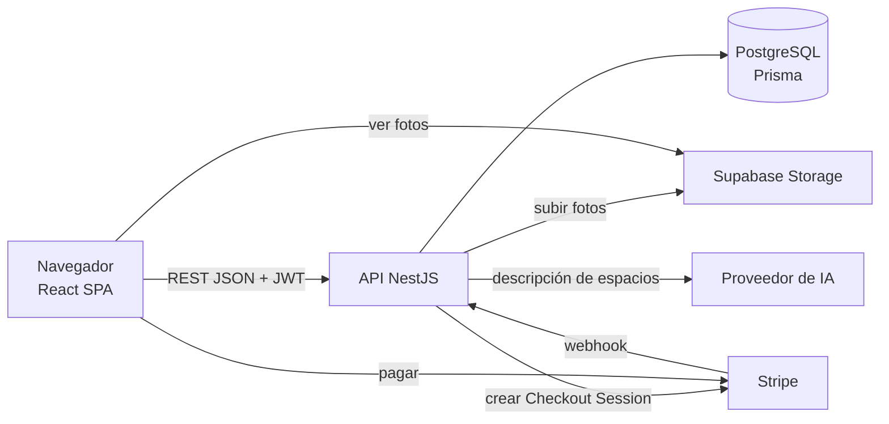
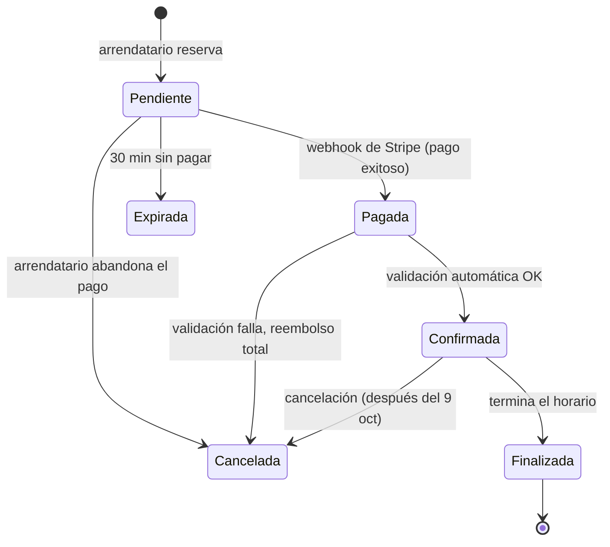
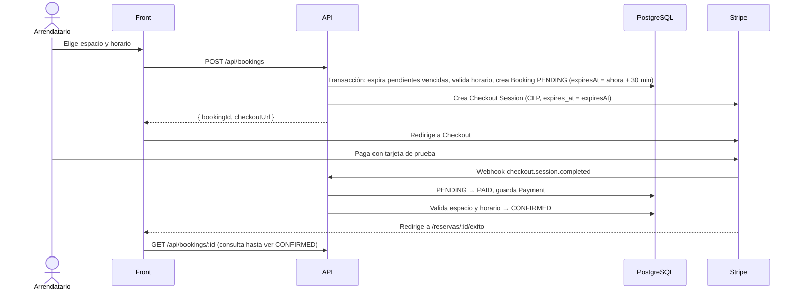

# Arquitectura

## Vista general



- **Front** (`rentsmart-front`): SPA en React 19 + Vite 8 + Tailwind 4, en TypeScript ([P-04](decisiones.md#p-04--front-en-typescript)).
- **Back** (`rentsmart-back`): API REST en NestJS 12 + TypeScript.
- **Base de datos:** PostgreSQL con Prisma ([P-03](decisiones.md#p-03--postgresql--prisma)).
- **Fotos:** Supabase Storage ([P-10](decisiones.md#p-10--fotos-en-supabase-storage)).
- **Pagos:** Stripe Checkout en modo test.
- **IA:** proveedor por definir ([P-15](https://github.com/AlejandroMG/inf331-equipo-3/issues/82)), detrás de una interfaz propia.

## Backend

Un módulo de NestJS por dominio. Cada integrante trabaja en sus módulos para evitar conflictos.

| Módulo | Responsabilidad | Dueño |
|---|---|---|
| `prisma` | `PrismaService` compartido y migraciones | A |
| `auth` | Registro, login, JWT, `JwtAuthGuard`, `RolesGuard`, `@CurrentUser()` | A |
| `users` | Perfil y modo propietario | A |
| `ai` | `AiProvider` (interfaz), implementación real y mock | A |
| `admin` | Endpoints de administración | A |
| `reviews` | Reseñas (después del 9 de octubre) | A |
| `spaces` | CRUD de espacios, reglas de publicación | B |
| `space-types` | Tipos de espacio, equipamiento, regiones y comunas | B |
| `catalog` | Listado público, filtros y búsqueda | B |
| `storage` | `StorageService` sobre Supabase Storage | B |
| `availability` | Horario semanal y servicio `isAvailable()` | C |
| `bookings` | Reservas, máquina de estados, validación de conflictos | C |
| `payments` | Stripe Checkout, webhook, registro de pagos y reembolsos | C |

Estructura de cada módulo:

```
src/bookings/
├── bookings.module.ts
├── bookings.controller.ts
├── bookings.service.ts
├── bookings.service.spec.ts
└── dto/
    └── create-booking.dto.ts
```

### Convenciones de la API

- REST JSON bajo el prefijo `/api`. Swagger (`@nestjs/swagger`) en `/docs`.
- Autenticación con `Authorization: Bearer <jwt>`.
- DTOs validados con `class-validator` mediante un `ValidationPipe` global.
- Códigos de error: 400 validación, 401 sin sesión, 403 sin permiso, 404 no existe, 409 conflicto de estado o de horario.
- Fechas en ISO 8601 y UTC. Montos en CLP como enteros.
- Listados paginados con `?page=1&pageSize=20`; la respuesta trae `{ items, total, page, pageSize }`.

## Frontend

```
rentsmart-front/src/
├── components/     ← Button, Input, Card, Modal, Toast
├── features/
│   ├── auth/       ← A
│   ├── admin/      ← A
│   ├── renter/     ← A: panel del arrendatario
│   ├── spaces/     ← B: publicar y editar
│   ├── catalog/    ← B: catálogo y detalle
│   ├── owner/      ← B: panel del propietario
│   └── bookings/   ← C: horario semanal, widget de reserva, pago
├── lib/            ← cliente HTTP, manejo del token, utilidades de fecha y dinero
├── mocks/          ← handlers de MSW mientras el back no exista
└── routes.tsx
```

- Rutas con React Router (`src/routes.tsx`, un arreglo de `RouteObject`). Cada dominio agrega las suyas. Las rutas dentro de `<RequireAuth />` exigen token y, sin él, redirigen a `/login` guardando la ruta pedida en `state.from`.
- El cliente HTTP (`src/lib/http.ts`) lee la URL base desde `VITE_API_URL` (sin `/api`: el cliente lo agrega), adjunta `Authorization: Bearer <token>` y convierte las respuestas con error en `ApiError` (`status`, `message` en español, `data`). Ante un 401 borra el token. El token vive en `localStorage` (`src/lib/token.ts`).
- Tailwind 4 se carga con el plugin `@tailwindcss/vite`; no hay `tailwind.config.js`. Los colores, tipografías y radios de la marca son variables `@theme` en `src/index.css` y dan utilidades como `bg-primary`, `text-ink`, `border-line`, `font-display` y `rounded-card`.
- Componentes base en `src/components/`: `Button` y `LinkButton`, `Input`, `Card`, `Modal` (`<dialog>` nativo) y `Toast` (`ToastProvider` más el hook `useToast`).
- En desarrollo, `/dev/componentes` muestra una guía de esos componentes. No existe en producción.
- Pruebas: `npm test` ejecuta Vitest con jsdom, Testing Library y MSW. Los handlers de la API simulada están en `src/mocks/handlers.ts` y los usan tanto los tests (`src/mocks/server.ts`) como el navegador (`src/mocks/browser.ts`, con `VITE_USE_MOCKS=true`). El setup (`src/test/setup.ts`) falla cualquier petición sin handler y simula `<dialog>`, que jsdom no implementa. Los tests viven junto al código (`*.test.ts` y `*.test.tsx`).
- Catálogo y detalle (BU-01, BU-02): el contrato de `GET /api/catalog` y `GET /api/catalog/:id` está en [Catálogo público](#catálogo-público-bu-01-bu-02) (sección del back). El front usa los tipos de `src/features/catalog/types.ts` y el mismo contrato en `src/mocks/handlers.ts`. `useRequest` (`src/lib/useRequest.ts`) carga datos con cancelación, estado de carga y "Reintentar"; úsalo en las pantallas nuevas.
- Mientras A no entregue el login (CU-02), para entrar a una ruta privada en local: `localStorage.setItem('rentsmart_token', 'dev')` en la consola del navegador.

## Modelo de datos

Borrador para F-03 ([#3](https://github.com/AlejandroMG/inf331-equipo-3/issues/3)). Los nombres finales quedan en `schema.prisma`.

| Entidad | Campos clave | Dueño |
|---|---|---|
| `User` | email (único), passwordHash, name, phone, role (`USER` · `ADMIN`), isHost, status (`ACTIVE` · `SUSPENDED`) | A |
| `Region` · `Commune` | Lista cerrada cargada por el seed | B |
| `SpaceType` · `Amenity` | Catálogos administrables; `SpaceAmenity` como tabla intermedia | B |
| `Space` | ownerId, typeId, name, description, capacity, pricePerHour?, pricePerDay?, regionId, communeId, address (pública), addressDetail (privada), rules, status (`DRAFT` · `ACTIVE` · `INACTIVE` · `BLOCKED`) | B |
| `SpacePhoto` | spaceId, storagePath, url, position | B |
| `AvailabilityRule` | spaceId, weekday (0–6), startTime, endTime (hora local, bloques de 1 h) | C |
| `Booking` | spaceId, renterId, startAt, endAt, unit (`HOUR` · `DAY`), subtotal, fee, total, status, expiresAt, stripeCheckoutSessionId | C |
| `BookingEvent` | bookingId, fromStatus, toStatus, actorId (nulo si fue el sistema), reason, createdAt | C |
| `Payment` | bookingId, stripeSessionId, stripePaymentIntentId, amount, fee, refundedAmount, status | C |
| `Review` | bookingId (único), authorId, spaceId, rating 1–5, comment (después del 9 de octubre) | A |

Estados de `Booking`: `PENDING`, `PAID`, `CONFIRMED`, `FINISHED`, `CANCELLED`, `EXPIRED`.

### Migraciones y seed

- El schema vive en `rentsmart-back/prisma/schema.prisma` y el cliente se genera en `src/generated/prisma` (no se versiona). Tras cada `git pull` con migraciones nuevas: `npx prisma migrate dev`.
- `booking_no_overlap` es una migración SQL escrita a mano (ver [Cómo se evitan reservas cruzadas](#cómo-se-evitan-reservas-cruzadas)).
- Cambios al schema: PR chico, solo del schema, avisando en el grupo; A lo revisa.
- `npm run seed` carga:

| Dato | Contenido |
|---|---|
| Usuarios | `admin@rentsmart.test` (ADMIN), `propietario@rentsmart.test` (USER, isHost), `arrendatario@rentsmart.test` (USER). Contraseña `Password123` |
| Tipos de espacio | Los 8 de P-08 |
| Ubicación | Región Metropolitana con 5 comunas |
| Equipamiento | 5 ítems básicos |
| Espacios | 10 en estado `ACTIVE`, del propietario de prueba, con horario lunes a viernes 09:00–21:00 y sin fotos |

### Fechas y dinero

- Las fechas se guardan como `timestamptz` en UTC y se muestran en `America/Santiago`.
- El horario semanal (`AvailabilityRule`) está en hora local de Santiago; el servicio de disponibilidad lo convierte a UTC para compararlo con las reservas. Hay que probar el cambio de horario de verano.
- Los montos son enteros en CLP. Stripe trata el CLP como moneda sin decimales, así que el monto se envía tal cual, sin multiplicar por 100.

## Ciclo de vida de una reserva

Decisiones [P-05](decisiones.md#p-05--reserva-inmediata) y [P-06](decisiones.md#p-06--pendiente--pagada--confirmada).



| Transición | La dispara | Historia |
|---|---|---|
| → Pendiente | Arrendatario al confirmar la reserva | RE-02 |
| Pendiente → Pagada | Webhook `checkout.session.completed` | PA-02 |
| Pendiente → Expirada | Webhook `checkout.session.expired`, o limpieza antes de crear una reserva | PA-02, RE-02 |
| Pagada → Confirmada | Validación automática: espacio activo y horario libre | RE-04 |
| Pagada → Cancelada | Validación fallida; reembolso total automático | RE-04 |
| Confirmada → Finalizada | Tarea programada al terminar el horario | RE-06 |
| Confirmada → Cancelada | Arrendatario o propietario, según política | RE-05 |

Toda transición pasa por un único método del servicio de reservas que valida el cambio (409 si no es válido) y escribe un `BookingEvent`.

### Flujo de pago



### Cómo se evitan reservas cruzadas

1. **En el servicio:** `availability.isAvailable()` revisa el horario semanal y las reservas activas antes de crear la reserva.
2. **En la base de datos:** una restricción de exclusión impide que dos reservas activas del mismo espacio se traslapen, aunque lleguen dos solicitudes al mismo tiempo. Prisma no la genera, así que va en SQL dentro de una migración:

```sql
CREATE EXTENSION IF NOT EXISTS btree_gist;

ALTER TABLE "Booking" ADD CONSTRAINT booking_no_overlap
  EXCLUDE USING gist (
    "spaceId" WITH =,
    tstzrange("startAt", "endAt", '[)') WITH &&
  ) WHERE (status IN ('PENDING', 'PAID', 'CONFIRMED'));
```

Como una `PENDING` vencida sigue contando para la restricción, antes de insertar se pasan a `EXPIRED`, en la misma transacción, las pendientes del espacio cuyo `expiresAt` ya pasó.

## Integraciones

### Stripe

- Stripe Checkout en modo test, moneda CLP. Por ahora sin Stripe Connect ([P-12](https://github.com/AlejandroMG/inf331-equipo-3/issues/79) sigue abierta).
- La Checkout Session expira a los 30 minutos, el mínimo que permite Stripe, y coincide con la retención de la reserva.
- El webhook está en `POST /api/payments/webhook`. Para verificar la firma, Nest necesita el body sin parsear: `NestFactory.create(AppModule, { rawBody: true })`.
- El webhook es idempotente: guarda el ID del evento y no procesa dos veces el mismo.
- En local se usa Stripe CLI: `stripe listen --forward-to localhost:3000/api/payments/webhook`.
- Tarjeta de prueba: `4242 4242 4242 4242`, cualquier fecha futura y cualquier CVC.

### Supabase Storage

- Bucket `space-photos` con lectura pública.
- Se sube desde el back con la service role key, que nunca llega al front.
- `StorageService` es una interfaz con dos implementaciones: Supabase y disco local para tests.

### IA

- Interfaz `AiProvider` con `describeSpace(fotos, datos)`. Una implementación real (proveedor según P-15) y un mock determinista para tests.
- Timeout, límite de usos por usuario y un mensaje de respaldo si el proveedor falla.
- El texto generado siempre queda editable y el propietario lo revisa antes de publicar.

## Variables de entorno

Solo `PORT`, `VITE_API_URL` y `VITE_USE_MOCKS` existen hoy. Las demás se agregan a `.env.example` en la historia que las introduce.

| Variable | App | Para qué | Historia |
|---|---|---|---|
| `PORT` | back | Puerto de la API (3000 por defecto) | — |
| `VITE_API_URL` | front | URL base de la API. En desarrollo, `http://localhost:5173` usa el proxy de Vite (sin CORS) | F-07 |
| `VITE_USE_MOCKS` | front | `true` activa MSW en el navegador para simular la API (solo desarrollo; opcional) | F-08 |
| `DATABASE_URL`, `DATABASE_TEST_URL` | back | Conexión a PostgreSQL | F-04, F-03 |
| `JWT_SECRET`, `JWT_EXPIRES_IN` | back | Firma y duración del token | CU-02 |
| `FRONTEND_URL` | back | Origen permitido por CORS y URLs de retorno de Stripe | CU-05 |
| `SUPABASE_URL`, `SUPABASE_SERVICE_ROLE_KEY`, `SUPABASE_BUCKET` | back | Subida de fotos | ES-03 |
| `STRIPE_SECRET_KEY`, `STRIPE_WEBHOOK_SECRET` | back | Checkout y verificación del webhook | PA-01, PA-02 |
| `PLATFORM_FEE_PERCENT` | back | Comisión de la plataforma (depende de P-13) | RE-02 |
| `AI_API_KEY`, `AI_MODEL` | back | Proveedor de IA (depende de P-15) | IA-01 |

## Pruebas

| Nivel | Herramienta | Qué cubre |
|---|---|---|
| Unitarias back | Jest | Servicios: disponibilidad, estados de reserva, precios, reglas de publicación |
| Integración API | Jest + Supertest + BD de test (Docker) | Endpoints con base de datos real |
| Componentes front | Vitest + Testing Library + MSW | Formularios y componentes con lógica |
| E2E | Playwright | Flujo completo (después del 9 de octubre, QA-01) |

La meta de cobertura espera la respuesta del profesor ([P-11](https://github.com/AlejandroMG/inf331-equipo-3/issues/78)). Mientras tanto se aplica la [definición de terminado](flujo-de-trabajo.md#definición-de-terminado).
